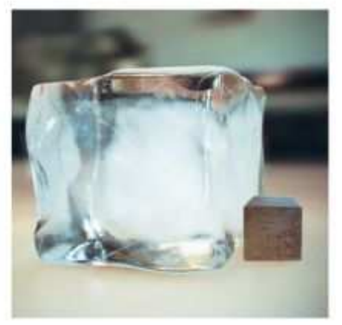
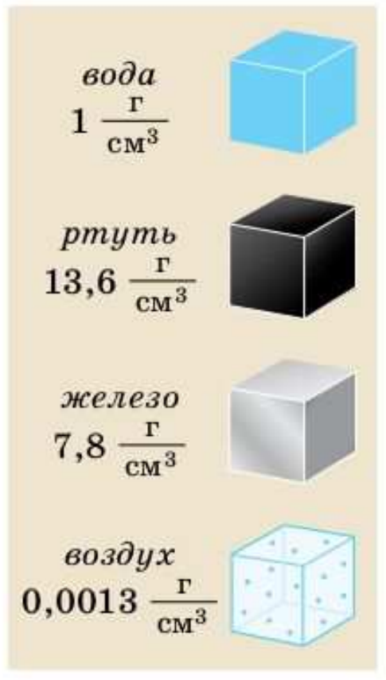

# §23. Плотность вещества

> Источник: Перышкин И. М., Иванов А. И., «Физика. 7 класс. Базовый уровень» (2026), стр. 75–79.
> Ключевые слова: плотность вещества, килограмм на метр кубический, грамм на сантиметр кубический, таблица плотностей, индейка амбач, осмий, агрегатное состояние и плотность, воды аномалия.

Поставим на чаши весов железный и алюминиевый цилиндры равного объёма. Равновесие весов нарушилось (рис. 55), значит, тела имеют разные массы. Соответственно тела одинаковой массы, изготовленные из разных веществ, имеют разные объёмы (рис. 56). Задумывались ли вы, почему различные тела одинакового объёма имеют разную массу?

Объясним это с позиций молекулярного строения вещества. Вы знаете, что вещество состоит из молекул, между которыми есть промежутки. Молекулы разных веществ имеют разную массу. Так, масса молекулы ртути примерно в 11 раз больше массы молекулы воды. И расстояние между молекулами в разных веществах разное. Именно это объясняет тот факт, что тела одинакового объёма, изготовленные из разных веществ, имеют разную массу. Данное различие определяется физической величиной, которую называют **плотностью вещества**.

Плотность вещества показывает, чему равна масса этого вещества, взятого в единице объёма (1 м³ или 1 см³).

Для того чтобы определить плотность вещества, нужно массу тела разделить на его объём.

> **Плотность — это физическая величина, равная отношению массы тела к его объёму.**

плотность = масса/объём

Плотность обозначают греческой буквой ρ («ро»). Зная обозначение массы (*m*) и объёма (*V*), можно записать формулу для определения плотности вещества:

ρ = m/V

Единицей плотности в СИ является **килограмм на метр кубический** (кг/м³). Действительно, поскольку единицей массы является килограмм, а объёма — кубический метр, то

1 кг/1 м³ = 1 кг/м³

Плотность является характеристикой вещества. Для данного вещества при данных условиях плотность — величина постоянная. Плотности веществ определяют экспериментально и заносят в специальные таблицы.

### Таблица 3. Плотности некоторых твёрдых тел

| Твёрдое тело | ρ, кг/м³ | ρ, г/см³ | Твёрдое тело | ρ, кг/м³ | ρ, г/см³ |
|---|---|---|---|---|---|
| Осмий | 22 600 | 22,6 | Мрамор | 2700 | 2,7 |
| Иридий | 22 400 | 22,4 | Стекло оконное | 2500 | 2,5 |
| Платина | 21 500 | 21,5 | Фарфор | 2300 | 2,3 |
| Золото | 19 300 | 19,3 | Бетон | 2300 | 2,3 |
| Свинец | 11 300 | 11,3 | Кирпич | 1800 | 1,8 |
| Серебро | 10 500 | 10,5 | Сахар-рафинад | 1600 | 1,6 |
| Медь | 8900 | 8,9 | Оргстекло | 1200 | 1,2 |
| Латунь | 8500 | 8,5 | Капрон | 1100 | 1,1 |
| Сталь, железо | 7800 | 7,8 | Полиэтилен | 920 | 0,92 |
| Олово | 7300 | 7,3 | Парафин | 900 | 0,90 |
| Цинк | 7100 | 7,1 | Лёд | 900 | 0,90 |
| Чугун | 7000 | 7,0 | Дуб (сухой) | 700 | 0,70 |
| Корунд | 4000 | 4,0 | Сосна (сухая) | 400 | 0,40 |
| Алюминий | 2700 | 2,7 | Пробка | 240 | 0,24 |

### Таблица 4. Плотности некоторых жидкостей (при температуре 20 °С)

| Жидкость | ρ, кг/м³ | ρ, г/см³ | Жидкость | ρ, кг/м³ | ρ, г/см³ |
|---|---|---|---|---|---|
| Ртуть | 13 600 | 13,60 | Керосин | 800 | 0,80 |
| Серная кислота | 1800 | 1,80 | Спирт | 800 | 0,80 |
| Мёд | 1350 | 1,35 | Нефть | 800 | 0,80 |
| Вода морская | 1030 | 1,03 | Ацетон | 790 | 0,79 |
| Молоко цельное | 1030 | 1,03 | Эфир | 710 | 0,71 |
| Вода чистая | 1000 | 1,00 | Бензин | 710 | 0,71 |
| Масло подсолнечное | 930 | 0,93 | Жидкое олово (при t = 400 °С) | 6800 | 6,80 |
| Масло машинное | 900 | 0,90 | Жидкий воздух (при t = −194 °С) | 860 | 0,86 |

### Таблица 5. Плотности некоторых газов (при нормальном атмосферном давлении и температуре 20 °С)

| Газ | ρ, кг/м³ | ρ, г/см³ | Газ | ρ, кг/м³ | ρ, г/см³ |
|---|---|---|---|---|---|
| Хлор | 3,210 | 0,00321 | Оксид углерода (II) (угарный газ) | 1,250 | 0,00125 |
| Оксид углерода (IV) (углекислый газ) | 1,980 | 0,00198 | Природный газ | 0,800 | 0,0008 |
| Кислород | 1,430 | 0,00143 | Водяной пар (при 100 °С) | 0,590 | 0,00059 |
| Воздух (при 0 °С) | 1,300 | 0,00130 | Гелий | 0,180 | 0,00018 |
| Азот | 1,250 | 0,00125 | Водород | 0,090 | 0,00009 |

Найдём в таблице 4 плотность воды. Как понимать, что плотность воды 1000 кг/м³? Ответ следует из определения плотности: масса 1 м³ воды равна 1000 кг.

На практике часто применяют единицу плотности **грамм на сантиметр кубический** (г/см³) (рис. 57). Найдём связь между единицами плотности на примере воды:

ρ_в = 1000 кг/м³ = 1000 · 1000 г/1 000 000 см³ = 1 г/см³

*Значение плотности, выраженное в граммах на сантиметр кубический (г/см³), в 1000 раз меньше её значения, выраженного в килограммах на метр кубический (кг/м³).*

Различные вещества могут сильно отличаться друг от друга по плотности. Так, например, ртуть имеет плотность 13,6 г/см³, а воздух — 0,0013 г/см³, т. е. плотность воздуха в 10 460 раз меньше, чем плотность ртути. Разница громадная. Но оказывается, во Вселенной встречаются вещества, во много раз более плотные, чем ртуть, и вещества, во много раз менее плотные, чем воздух.

Самые большие плотности имеют вещества в твёрдом состоянии, самые маленькие — газы. Одно и то же вещество в разных агрегатных состояниях имеет разную плотность. Как правило, в жидком состоянии плотность вещества меньше, чем в твёрдом. Исключение составляет вода (см. табл. 3, 4).

Зная плотность вещества, можно предположительно определить его агрегатное состояние. Рассчитав плотности планет Солнечной системы, учёные поняли, что планеты Марс, Венера и Меркурий имеют твёрдую поверхность, так как их плотности близки к плотности Земли. Совершенно иной состав веществ у Юпитера и Сатурна. Средняя плотность Юпитера 1,33 г/см³, а Сатурна ещё меньше — 0,69 г/см³. По-видимому, основная масса вещества, находящегося под газовой оболочкой этих планет, должна состоять из жидкого вещества.

## Вопросы (стр. 79)

1. Что такое плотность?
2. По какой формуле можно рассчитать плотность вещества?
3. Зависит ли плотность вещества от объёма тела; от массы?
4. Какие единицы плотности вам известны?

**Дополнительное задание (стр. 79):**

1. Какие опыты вы предложили бы провести, чтобы подтвердить, что плотность является характеристикой вещества, не зависящей от его массы и объёма?
2. Проанализируйте таблицы 3 и 4. Найдите вещество, у которого плотность в жидком состоянии больше плотности в твёрдом состоянии. Какие природные явления существуют благодаря этому свойству?

### Упражнение 12 (стр. 79)

1. Что имеют в виду, когда говорят, что алюминий легче стали?
2. Плотность древесины дерева амбач (растёт в тропической части Африки) 0,04 г/см³. Что это означает?
3. Три кубика — из серебра, стекла и меди — имеют одинаковый объём. Какой из кубиков имеет наибольшую массу, а какой — наименьшую?
4. Два бруска, из алюминия и стали, имеют одинаковый объём. Какой из брусков обладает большей массой и во сколько раз? (Найдите отношение m₂/m₁.)
5. Во сколько раз масса кислорода объёмом 1 м³ больше массы водорода того же объёма? Необходимые данные возьмите из таблицы 5.
6. Кусок металла массой 21,9 г имеет объём 3 см³. Найдите плотность металла и, пользуясь таблицей 3, определите, что это за металл. Выразите плотность в г/см³; кг/м³.
7. Деревянный брусок длиной 10 см, шириной 5,5 см и высотой 2 см уравновешен на весах гирями 50 г, 20 г, 5 г, 2 г. Из какого дерева сделан брусок?
8*. Имеются две одинаковые банки: одна с водой, другая с керосином. Банки с жидкостями уравновесили на рычажных весах. У какой жидкости уровень выше — у воды или керосина?
9*. Ртутный медицинский термометр показал повышение температуры. Как изменилась в нём плотность ртути; объём; масса?

### Задание 18 (стр. 80)

1. Возьмите нераспечатанную пачку соли или сахара. Определите плотность вещества, проведя необходимые измерения.
2. Возьмите кусок мыла, имеющий форму прямоугольного параллелепипеда. Проведите необходимые измерения и определите плотность мыла. Сравните полученное вами значение плотности с результатами одноклассников. Равны ли полученные значения? Почему?
