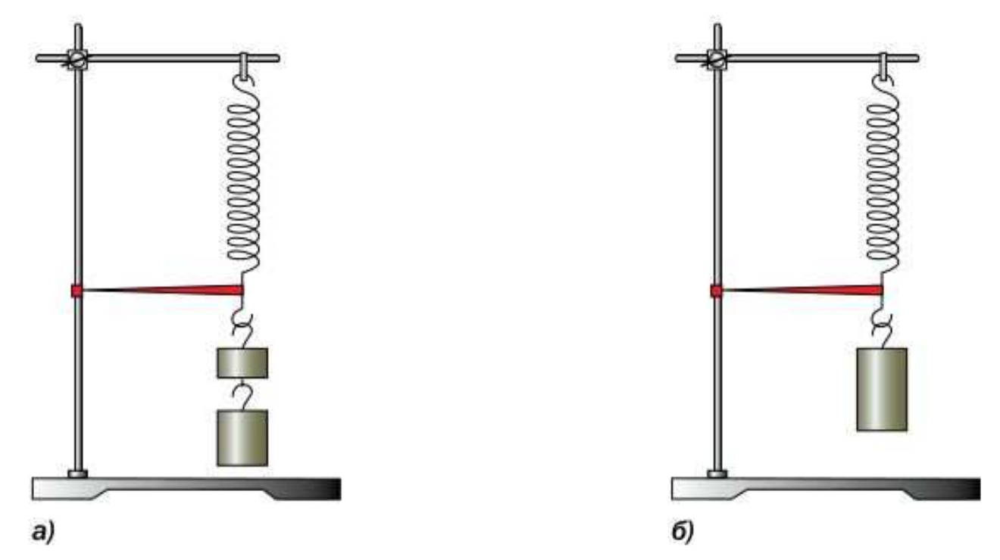
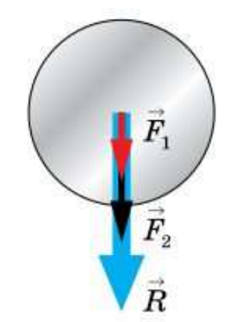
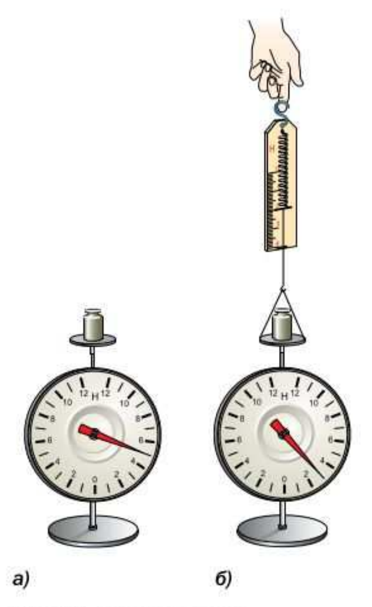
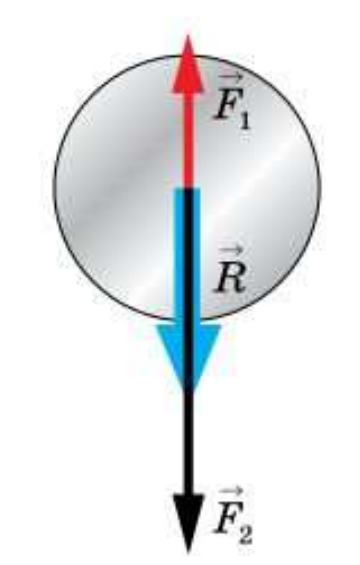

# §31. Сложение двух сил, направленных по одной прямой. Равнодействующая сил

> Источник: Перышкин И. М., Иванов А. И., «Физика. 7 класс. Базовый уровень» (2026), стр. 104–106.
> Ключевые слова: равнодействующая сил, сложение сил по одной прямой, уравновешивающие силы, компенсация сил, сила сопротивления воздуха, равномерное движение под действием уравновешенных сил.

В большинстве случаев на тело действует не одна, а несколько сил. Например, на книгу, лежащую на столе, действует сила тяжести и сила упругости. На каплю дождя тоже действуют две силы: сила тяжести и сила сопротивления воздуха.

При решении практических задач действие нескольких сил можно заменить одной силой, равноценной им по действию.

> **Силу, которая производит на тело такое же действие, как несколько одновременно действующих на него сил, называют равнодействующей этих сил.**

Рассмотрим случай, когда на тело действуют две силы, направленные по одной прямой в одном направлении. Закрепим пружину одним концом на штативе, установленном на столе, вблизи другого конца закрепим стрелку-указатель. Подвесим к пружине один под другим грузы массой 102 и 204 г (весом 1 и 2 Н). Отметим положение указателя (рис. 82, а) и снимем грузы с пружины. Теперь к пружине подвесим груз весом 3 Н и увидим, что он растягивает пружину точно до нашей отметки (рис. 82, б). Это свидетельствует о том, что груз весом 3 Н оказал на пружину такое же действие, как грузы весом 1 и 2 Н вместе.

> **Следовательно, равнодействующая двух сил, направленных по одной прямой в одну сторону, направлена в ту же сторону, а её модуль равен сумме модулей действующих сил.**

На рисунке 83 показано правило сложения сил в этом случае:

R = F_1 + F_2

где F₁ и F₂ — действующие на тело силы, а R — их равнодействующая.

Как будет выглядеть это правило для сил, действующих на тело по одной прямой, но направленных в противоположные стороны? Поставим на столик динамометра груз весом 5 Н. Сила, действующая на столик со стороны груза, будет направлена вниз и равна 5 Н (рис. 84, а). Подействуем на столик с силой 2 Н, направленной вверх. Показание динамометра, на котором закреплён столик, станет 3 Н (рис. 84, б). В этом случае равнодействующая сил 5 и 2 Н равна их разности.

Таким образом, равнодействующая двух сил, направленных по одной прямой в противоположные стороны, направлена в сторону большей по модулю силы, а её модуль равен разности модулей действующих на тело сил (рис. 85):

R = F_2 - F_1

Если на тело действуют две силы, равные по модулю и направленные противоположно, то их равнодействующая равна нулю. Говорят, что эти силы уравновешивают, или компенсируют, друг друга. Под действием таких сил тело остаётся в покое (см. рис. 82) или движется равномерно и прямолинейно, ускорение тела в этом случае равно нулю.

## Вопросы (стр. 106)

1. Сколько сил может действовать на тело? Приведите примеры.
2. Дайте определение равнодействующей сил.
3. Чему равна равнодействующая двух сил, направленных по одной прямой в одну сторону?
4. Может ли тело, на которое действуют две силы, находиться в равновесии? Объясните почему. Приведите пример.

### Упражнение 19 (стр. 106)

1. Мальчик, масса которого 40 кг, держит в руке гирю массой 10 кг. С какой силой он давит на землю?
2. Клеть массой 250 кг поднимают из шахты, прикладывая силу 3 кН. Определите равнодействующую сил. Изобразите её на рисунке в выбранном вами масштабе.
3. Определите силу сопротивления воздуха, действующую на спускающегося на парашюте спортсмена. Сила тяжести парашютиста вместе с парашютом 900 Н. Движение считать равномерным.
4. Что покажет нижний динамометр в опыте на рисунке 84, если конец нити, привязанной к его столику, тянуть вверх с силой 5 Н?
