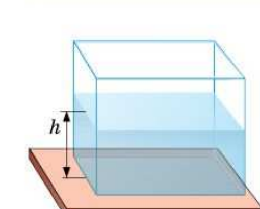
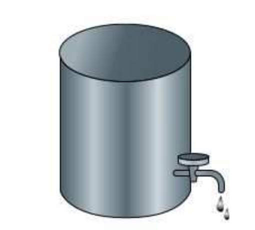
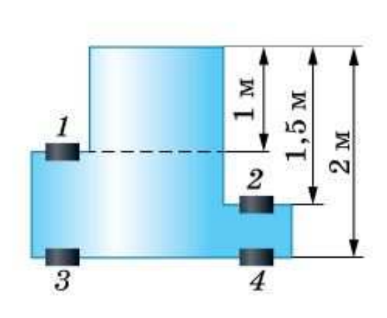

# §39. Расчёт давления жидкости на дно и стенки сосуда

> Источник: Перышкин И. М., Иванов А. И., «Физика. 7 класс. Базовый уровень» (2026), стр. 130–132.
> Ключевые слова: расчёт давления жидкости, формула p = ρgh, высота столба жидкости, давление на дно и стенки, зависимость давления от плотности и глубины, ртуть, кран с нефтью, пробки.

Определим давление жидкости на дно сосуда. Возьмём сосуд в форме прямоугольного параллелепипеда, заполненный водой (рис. 115).

Высоту столба жидкости, находящейся в сосуде, обозначим буквой *h*, площадь дна — *S*. Давление равно отношению силы, действующей на дно, к его площади. Сила *F*, с которой жидкость, налитая в сосуд, давит на его дно, — это вес жидкости *P*. Вес жидкости равен силе тяжести *P* = *gm* = *mg*. В итоге давление воды на дно сосуда равно

p = mg/S.

Массу жидкости вычислим по формуле *m* = ρ*V*. Объём налитой в сосуд жидкости *V* = *Sh*. Используя математические преобразования, получим формулу для расчёта давления жидкости:

p = mg/S = ρ V g/S = ρ S h g/S = ρ g h,

т. е.

> **p = ρgh** — формула для расчёта давления жидкости на дно и стенки сосуда.

Анализируя формулу, можно сделать вывод, что *давление жидкости на дно сосуда зависит от плотности жидкости и высоты столба жидкости*, но не зависит от площади дна сосуда.

Оказывается, по выведенной формуле можно рассчитывать давление жидкости, налитой в сосуд любой формы. По закону Паскаля на одной глубине жидкость оказывает одинаковое давление по всем направлениям. Поэтому если в любой точке на глубине *h* поместить маленькую плоскую пластинку, то независимо от того, как она ориентирована, давление жидкости на её грань будет также определяться по формуле *p* = ρ*g h*. По этой же формуле определяется и давление жидкости на стенки сосуда в любой точке на уровне *h*.

**Пример.** В цилиндр налита ртуть, высота столба которой 0,15 м. Определите давление ртути на дно цилиндра.

По таблице 4 найдём, что плотность ртути равна 13 600 кг/м³.

Запишем условие задачи и решим её.

*Дано:*
*h* = 0,15 м
ρ = 13 600 кг/м³
*g* = 10 м/с²
*p* — ?

*Решение:*
Давление ртути на дно цилиндра:
*p* = ρ*g h*,
*p* = 13 600 кг/м³ · 10 м/с² · 0,15 м = = 20 400 Па = 20,4 кПа.

**Ответ:** *p* = 20,4 кПа.

**Вопросы (стр. 131):**

1. Чем определяется давление жидкости на дно сосуда?
2. Почему для расчёта давления жидкости на дно и стенки сосуда можно использовать одну и ту же формулу?
3. Как рассчитать давление внутри жидкости на глубине *h*?

**Упражнение 22 (стр. 131–132):**

1. Вычислите давление жидкости плотностью 1800 кг/м³ на дно сосуда, если высота столба жидкости 0,1 м.
2. На сколько давление воды на глубине 10 м больше, чем на глубине 1 м?

3. В ёмкости, наполненной нефтью до верху, на расстоянии 140 см от крышки имеется кран (рис. 116). Определите давление на кран.

4*. Сосуд, имеющий форму, показанную на рисунке 117, заполнен водой. Рассчитайте давление на каждую из четырёх пробок.

5. В сосуд налиты две несмешивающиеся жидкости, одна поверх другой. Высота каждого слоя 3 см. Найдите давление жидкости на расстоянии 2 см от дна сосуда, если внизу находится вода, а сверху — машинное масло.

**Задание 28 (стр. 132):**

1. Возьмите пластиковую бутылку объёмом 1,5–2 л (или высокий сосуд). На одной вертикали проткните несколько отверстий. Заполните бутылку водой. Наблюдайте за вытекающими струями. Зарисуйте или сфотографируйте наблюдаемую картину. Объясните её.
2. Возьмите пластиковую бутылку. Отрежьте её дно и отвинтите крышку. По диаметру горлышка вырежьте кружочек из плотной бумаги или тонкого картона. Через центр кружочка проденьте нить с узелком на конце. Длина нити должна быть больше высоты бутылки. Нить пропустите через бутылку. Удерживая кружок прижатым к горлышку с помощью нити, опустите бутылку в воду горлышком вниз. Отпустите нить. Вы заметите, что кружок удерживается на месте за счёт давления воды снизу. Тонкой струёй по стенке наливайте воду в бутылку, не меняя её положения. Заметьте, при какой высоте столба воды в бутылке кружок отпадёт от неё. Что демонстрирует этот опыт?
