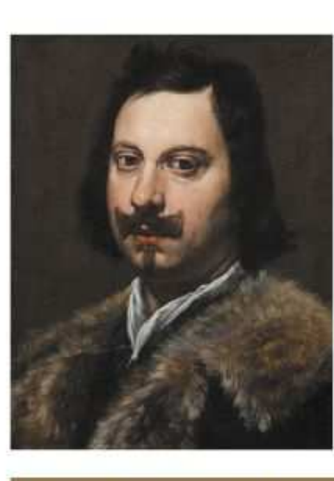
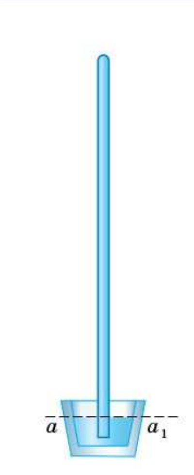
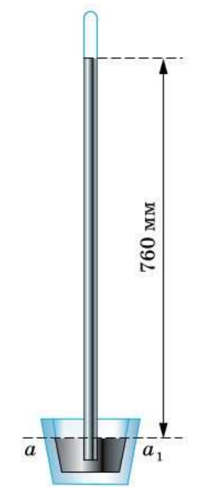
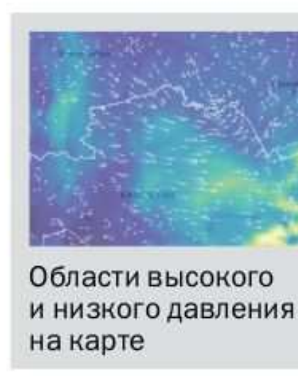
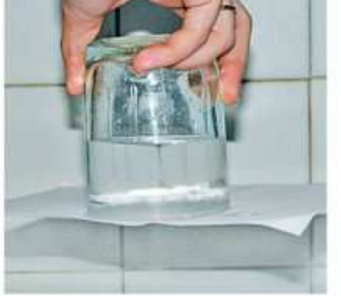
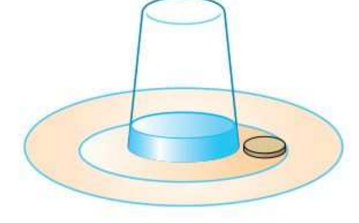

# §42. Измерение атмосферного давления. Опыт Торричелли

> Источник: Физика. 7 класс. Базовый уровень (Перышкин, Иванов, 2026), стр. 140–143
> Ключевые слова: атмосферное давление, измерение давления, опыт Торричелли, ртуть, 760 мм ртутного столба, торричеллиева пустота, ртутный барометр, миллиметр ртутного столба, 133,3 Па, 1013 гПа, ветер, карта атмосферного давления, упражнение 25, задание 31, стакан с бумагой

Каково же численное значение атмосферного давления? Как его определить?

Атмосферное давление **нельзя вычислять так же, как давление в жидкости, по формуле p = ρgh**. Ведь плотность воздуха и ускорение свободного падения уменьшаются с высотой, и у атмосферы определённой границы нет.

Можно ли измерить атмосферное давление?

**Проделаем опыт.** В длинную стеклянную трубку, запаянную с одного конца, нальём доверху воды. Зажмём открытый конец трубки пальцем и, перевернув, опустим её в сосуд с водой (рис. 132). Убрав палец, увидим, что вода не вытекает из трубки.

Почему так происходит? Атмосфера давит на поверхность воды в сосуде. В каждой точке на горизонтальном уровне *aa*₁, в том числе и внутри трубки, давление одно и то же и равно атмосферному. Поскольку вода из трубки не вытекает, давление столба воды в трубке меньше атмосферного. Можно ли изменить опыт так, чтобы жидкость из трубки стала вытекать? Чтобы жидкость вытекала из трубки, нужно повысить давление столба жидкости. Это можно сделать, увеличив высоту столба жидкости или её плотность.

Итальянский учёный Торричелли вместо воды взял жидкость с существенно большей плотностью — **ртуть**. Трубку использовал высотой 1 м. Опустив трубку с ртутью в сосуд с ртутью, он обнаружил, что ртуть частично вылилась из трубки. При этом над ртутью в трубке образовалось безвоздушное пространство (рис. 133). Высота столба ртути, оставшейся в трубке, оказалась равной примерно **760 мм**.

Как по результату этого опыта определить атмосферное давление? На уровне *aa*₁ (см. рис. 133) давление в трубке равно атмосферному. Поскольку в верхней части трубки осталось безвоздушное пространство, **атмосферное давление равно давлению столба ртути в трубке**. Зная высоту *h* столба ртути, его давление легко вычислить. Если *h* = 760 мм, то по формуле *p* = ρ*gh* получим:

p = 13 600 кг/м³ · 9,8 м/с² · 0,76 м = 101 300 Па = 1013 гПа.

Это же значение имеет атмосферное давление.

Если атмосферное давление уменьшится, то и высота столба ртути в трубке уменьшится (часть ртути выльется в сосуд); если атмосферное давление увеличится, то и высота столба ртути в трубке увеличится (часть ртути из сосуда перейдёт в трубку).

Прибор с трубкой ртути, созданный на основе опыта Торричелли, стали использовать для измерения атмосферного давления. Такой прибор, как вам известно, называют **ртутным барометром**. Использование ртутного барометра привело к тому, что атмосферное давление измеряют в **миллиметрах ртутного столба (мм рт. ст.)**.

> **1 мм рт. ст. ≈ 133,3 Па.**

Итак, при высоте столба ртути 760 мм атмосферное давление равно 1013 гПа, т. е. на квадратный метр поверхности воздух давит с силой 101 300 Н, на каждый квадратный сантиметр — 10 Н.

Площадь ладони человека примерно 100 см², на неё действует сила атмосферного давления, равная 1000 Н. Это равносильно тому, что на руке стоит небольшой мотоцикл. Как же мы справляемся с такой силой и почему не чувствуем её?

Всякое тело, находящееся в воздухе, испытывает давление со всех сторон. Так, снизу на кисть руки тоже действует сила атмосферного давления, равная 1000 Н. В результате силы, действующие на ладонь и тыльную часть кисти, взаимно уравновешиваются. Не ощущаем же мы атмосферное давление из-за того, что внутри человека существует давление, равное атмосферному.

Атмосферное давление играет важную роль для жизни на Земле. Из курса географии вам известно, что с распределением атмосферного давления связаны направление и сила ветров. Разность давлений — главная причина в образовании ветров. Если бы не было движения масс воздуха, то дожди выпадали бы только над водными поверхностями. Передавая прогноз погоды, часто показывают карту, на которой отмечено изменение атмосферного давления. Вы, видимо, обращали внимание на области самого низкого и самого высокого давления (на экране они окрашены в разные цвета).

**Вопросы** (стр. 142)

1. Можно ли давление воздуха рассчитывать по формуле *p* = ρ*gh*? Ответ обоснуйте.
2. Опишите опыт, с помощью которого можно измерить атмосферное давление.
3. Атмосферное давление равно 770 мм рт. ст. Что это означает?
4. Какие единицы атмосферного давления вам известны?

**Подумай** (стр. 142)

Используя знания из географии и материал параграфа, объясните, что представляет собой ветер. От чего зависят сила и направление ветра?

**Упражнение 25** (стр. 142)

1. Столб воды какой высоты создаёт давление, равное 760 мм рт. ст.?
2. Вычислите силу атмосферного давления на поршень шприца площадью 3 см². Атмосферное давление равно 100 кПа.
3. Выразите в гектопаскалях давление: 1 мм рт. ст.; 730 мм рт. ст.; 770 мм рт. ст.
4*. Площадь дна кастрюли 1000 см². Какое давление будет испытывать дно открытой кастрюли, если в неё налить 3 кг воды?

**Задание 31** (стр. 143)

1. Если стакан с водой накрыть листом бумаги и, придерживая бумагу рукой, перевернуть, то бумага не отпадает после того, как рука убрана, и вода не вытекает (рис. 134). Почему?

2*. В мелкую тарелку положили монету и налили воду, чтобы она лишь прикрывала монету. Используя рисунок 135, придумайте, как достать монету, не замочив рук.

