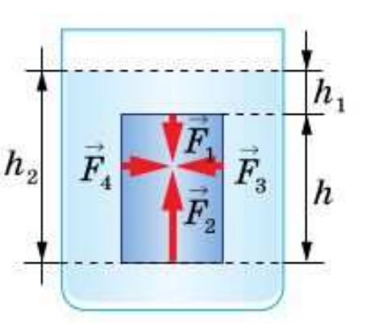
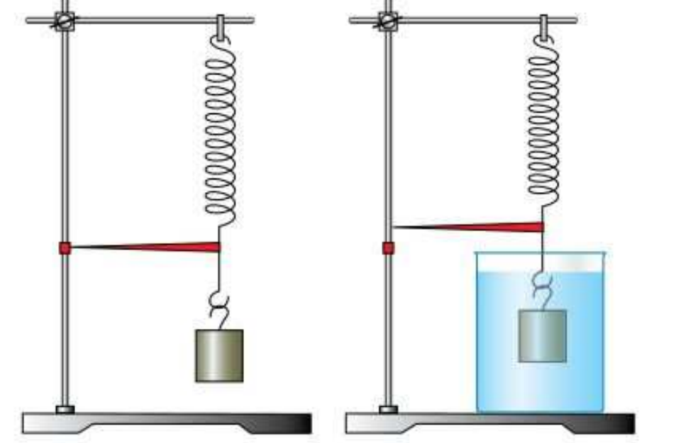
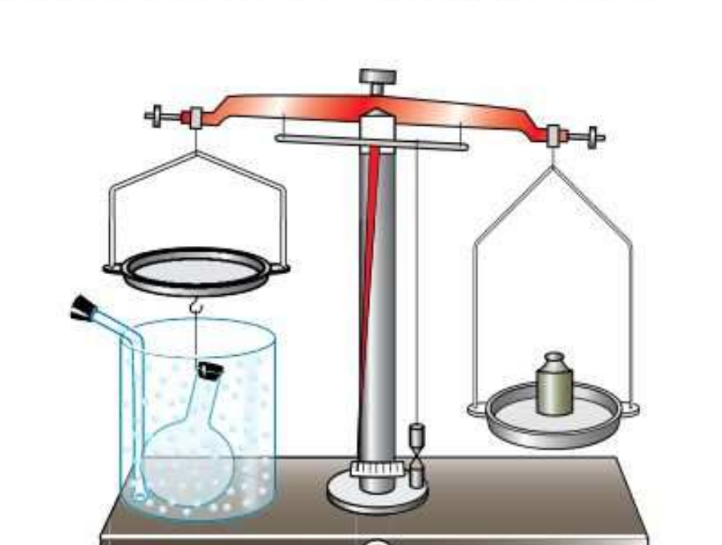

# §46. Действие жидкости и газа на погружённое в них тело

> Источник: Физика. 7 класс. Базовый уровень (Перышкин, Иванов, 2026), стр. 155–158
> Ключевые слова: выталкивающая сила, действие жидкости и газа на погружённое тело, параллелепипед в воде, разность сил давления F2 и F1, Fвыт = F2 − F1, Fвыт = ρж·g·V, вес жидкости в объёме тела, опыт с пружиной и телом, опыт с весами и колбой, углекислый газ, плавание тел в воде, сообщение с §47

В воде можно поднять такой большой камень, который вам не под силу поднять на суше. Погрузим мяч под воду и выпустим из рук, он всплывёт. Как объяснить эти и подобные явления?

Мы знаем, что находящаяся в сосуде жидкость оказывает давление на его дно и стенки. Если внутрь жидкости поместить тело, то жидкость будет оказывать давление и на него.

Рассмотрим параллелепипед, помещённый в воду (рис. 151). На все грани этого параллелепипеда со стороны жидкости действуют силы давления. Все боковые грани находятся в одинаковых условиях. Силы давления на боковые грани, например *F*₃ и *F*₄, равны по модулю и противоположны по направлению. Они уравновешивают друг друга.

Силы, действующие на верхнюю и нижнюю грани параллелепипеда, разные. На верхнюю грань давит столб жидкости высотой *h*₁. Сила давления *F*₁ на эту грань, направленная сверху вниз, равна

F_1 = p_1 S = ρ_ж g h_1 S,

так как давление жидкости *p*₁ = ρ_ж·g·h₁, а *S* — площадь грани параллелепипеда.

Давление на уровне нижней грани параллелепипеда производит столб жидкости высотой *h*₂. Поскольку внутри жидкости давление передаётся по всем направлениям, то на нижнюю грань параллелепипеда снизу вверх давит столб жидкости высотой *h*₂ с силой *F*₂, равной

F_2 = p_2 S = ρ_ж g h_2 S.

Так как *h*₂ > *h*₁, силы *F*₁ и *F*₂ не равны: *F*₂ > *F*₁. Поэтому на параллелепипед действует вверх *выталкивающая сила*, равная разности сил *F*₂ и *F*₁:

F_выт = F_2 - F_1.

Из рисунка 151 видно, что *h*₂ − *h*₁ = *h*, где *h* — высота параллелепипеда.

Тогда

F_выт = ρ_ж g h_2 S - ρ_ж g h_1 S = ρ_ж g S (h_2 - h_1) = ρ_ж g S h.

Но *Sh* = *V* — объём параллелепипеда, ρ_ж·*V* = *m*_ж — масса жидкости в объёме параллелепипеда, *m*_ж·g = *P*_ж — вес жидкости.

Следовательно,

F_выт = m_ж g = P_ж.

> **Выталкивающая сила равна весу жидкости в объёме погружённого в неё тела.**

Рассмотрим опыт, подтверждающий существование выталкивающей силы.

Подвесим тело к пружине со стрелкой-указателем (рис. 152, *а*). По положению указателя будем фиксировать растяжение пружины. Опустив тело в воду, заметим, что деформация пружины уменьшилась и тело поднялось вверх (рис. 152, *б*). Такой же результат можно получить, если на тело снизу вверх подействовать некоторой силой, например надавить рукой.

**Данный опыт подтверждает, что на тело, находящееся в жидкости, действует сила, выталкивающая его из жидкости.**

Действует ли выталкивающая сила на тело, находящееся в газе?

Для газов, как и для жидкости, выполняется закон Паскаля. Следовательно, в обычных земных условиях *на находящиеся в газе тела действует сила, выталкивающая их из газа*.

Проделаем опыт. Уравновесим на весах стеклянную колбу, закрытую пробкой, грузиком (рис. 153). Поместим под колбу широкий сосуд так, чтобы он полностью окружал колбу. Сосуд наполним углекислым газом. Плотность углекислого газа больше плотности воздуха, поэтому он на некоторое время останется в сосуде. При этом равновесие весов нарушится, чаша с подвешенной колбой поднимется вверх. Это объясняется тем, что в углекислом газе на колбу действует бо́льшая выталкивающая сила, чем в воздухе.

**Сила, выталкивающая тело из жидкости или газа, направлена противоположно силе тяжести, приложенной к этому телу.**

Поэтому вес тела в жидкости или газе меньше его веса в вакууме (пустоте). Этим объясняется, что в воде легче поднять тело, которое может быть трудно удержать в воздухе.

**Вопросы** (стр. 158)

1. Приведите примеры явлений из жизни, подтверждающие существование выталкивающей силы.
2. Чему равна выталкивающая сила, действующая на тело, погружённое в жидкость?
3. Объясните, почему на тело, погружённое в жидкость, действует выталкивающая сила.
4. Как на опыте показать, что на находящееся в газе тело действует выталкивающая сила? Какой газ вместо углекислого газа можно использовать в этом опыте?
