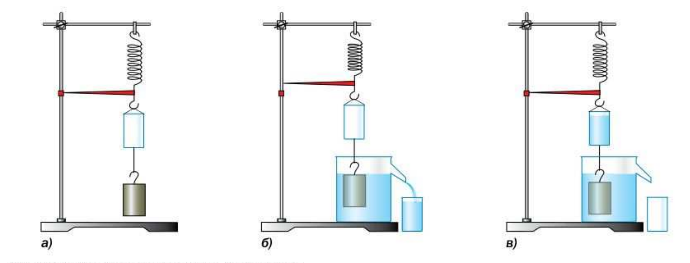
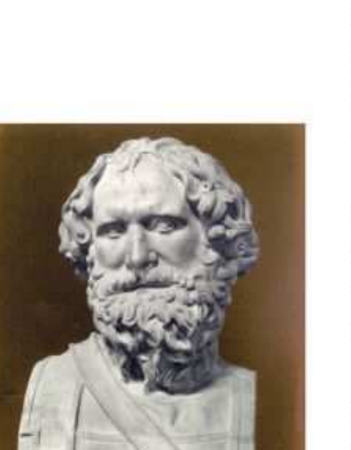

# §47. Архимедова сила

> Источник: Физика. 7 класс. Базовый уровень (Перышкин, Иванов, 2026), стр. 158–161
> Ключевые слова: Архимедова сила, закон Архимеда, ведро Архимеда, отливной сосуд, FА = ρж·Vп.ч·g, вытесненная жидкость, вес тела в жидкости, P1 = P − FА, потеря веса в воздухе, пример 15 дм³ ртуть 2040 Н, Архимед 287—212 до н. э., упражнение 29, задание 33

В предыдущем параграфе был сделан вывод, что выталкивающая сила равна весу жидкости в объёме погружённого в неё тела. Проверим этот вывод на опыте.

На пружине со стрелкой-указателем подвесим пустое ведёрко и металлический цилиндр такого же объёма (рис. 154, *а*). По растяжению пружины можно судить о весе тела. Отметим положение стрелки-указателя.

Погрузим цилиндр целиком в отливной сосуд, наполненный водой до уровня отливной трубки (рис. 154, *б*). При этом *часть воды, объём которой равен объёму тела*, из отливного сосуда выльется в стакан. Пружина сожмётся, стрелка-указатель поднимется, показывая, что вес погружённого в воду цилиндра уменьшился. Следовательно, на тело, погружённое в воду, наряду с силой тяжести действует сила, направленная вверх.

Вылившуюся в стакан воду перельём в ведёрко, не вынимая тела из отливного сосуда. Вода заполнит ведёрко доверху, а стрелка-указатель возвратится к первоначальному положению (рис. 154, *в*). Следовательно, вес тела при погружении в жидкость уменьшается на величину, равную весу жидкости в объёме тела.

Если в воду погрузить часть цилиндра, он вытеснит меньше жидкости (вспомните лабораторную работу № 4). Его вес уменьшится на величину веса воды в объёме части цилиндра, погружённой в жидкость.

Таким образом, **на тело, погружённое в жидкость, действует выталкивающая сила, равная весу жидкости в объёме части этого тела, погружённой в жидкость**. Это же справедливо и для тела, погружённого в газ: **на тело, находящееся в газе, действует выталкивающая сила, равная весу газа в объёме тела**.

> **Архимед** (287—212 до н. э.) — Древнегреческий учёный, установил правило равновесия рычага, открыл закон гидростатики

Впервые эта закономерность для тела, погружённого в жидкость, была установлена древнегреческим учёным **Архимедом**, поэтому её называют **законом Архимеда**. Силу, выталкивающую тело из жидкости или газа, называют **архимедовой силой** и обозначают *F*ₐ.

Таким образом, архимедова сила равна весу жидкости в объёме части тела, погружённой в жидкость, т. е. *F*ₐ = *P*_ж = *m*_ж·g. Масса жидкости, вытесняемой телом, *m*_ж = ρ_ж·*V*_п.ч, где ρ_ж — плотность жидкости, *V*_п.ч — объём части тела, погружённой в жидкость (так как объём *V*_ж вытесненной телом жидкости *V*ж = *V*п.ч). Тогда

> **F*ₐ = ρ*ж *V*_п.ч g.**

Из формулы следует, что архимедова сила тем больше, чем больше объём части тела, погружённой в жидкость, и плотность жидкости, в которую это тело погружено.

Определим вес находящегося в жидкости (или газе) тела. На него действуют сила тяжести, направленная вниз, и архимедова сила, направленная вверх. Вес тела в жидкости *P*₁ будет меньше веса тела в вакууме *P* = *mg*.

P_1 = P - F_А, или P_1 = mg - m_жg.

> **Итак, тело, погружённое в жидкость (или газ), теряет в своём весе столько, сколько весит вытесненная им жидкость (или газ).**

Если тела на рычажных весах уравновешены в воздухе, то это не значит, что они будут уравновешены в вакууме. В воздухе тело «весит» меньше, чем в вакууме.

Потеря веса в воздухе будет тем больше, чем больше объём тела. Вес куска дерева массой 1 т меньше веса куска железа той же массы. Почему? Потому что тонна дерева занимает больший объём (из-за меньшей плотности дерева), чем тонна железа. Потеря веса такого объёма дерева больше потери веса меньшего объёма железа. Однако эта потеря столь незначительна, что в обыденной жизни мы её не замечаем.

**Пример.** Определите выталкивающую силу, действующую на тело объёмом 15 дм³, полностью погружённое в ртуть.

Запишем условие задачи и решим её.

| Дано: | СИ | Решение: |
|-------|----|----------|
| *V*ₜ = 15 дм³ | 0,015 м³ | *F*ₐ = ρ_ж·*V*п.ч·g, |
| ρ_ж = 13 600 кг/м³ | | *F*ₐ = 13 600 кг/м³ × × 0,015 м³ × × 10 м/с² = |
| *g* = 10 м/с² | | = 2040 Н ≈ 2 кН. |
| *F*ₐ — ? | | |

**Ответ:** *F*ₐ ≈ 2 кН.

**Вопросы** (стр. 161)

1. Опишите опыт, изображённый на рисунке 154. Что он доказывает?
2. Какую силу называют архимедовой?
3. По какой формуле можно рассчитать архимедову силу?
4. От каких величин и как зависит архимедова сила?

**Подумай** (стр. 161)

Как изменится выталкивающая сила (см. пример), если аналогичный эксперимент провести в космическом корабле, находящемся на поверхности Луны?

**Упражнение 29** (стр. 161)

1. К одной чаше весов подвешен цилиндр из алюминия, а к другой — оловянный такой же массы. Весы находятся в равновесии. Оба цилиндра одновременно погрузили в воду. Равновесие весов нарушилось. Объясните почему. Какая чаша весов перевесила?
2. К коромыслу весов подвешены два железных шарика одинакового объёма. Нарушится ли равновесие весов, если один шарик погрузить в воду, другой — в керосин? Ответ обоснуйте.
3. Какую силу нужно приложить, чтобы кусок гранита объёмом 40 дм³ удержать в воде; в воздухе?
4. В какой воде, пресной или морской, на человека действует бо́льшая выталкивающая сила?
5*. Одинаковая ли сила потребуется для того, чтобы удержать пустое ведро в воздухе и это же ведро, но наполненное водой, в воде? Ответ поясните.

**Задание 33** (стр. 161)

- Измерьте выталкивающую силу, действующую на банку с водой, когда она погружена в воду наполовину; целиком. Выясните зависимость выталкивающей силы от глубины погружения тела в жидкость.
