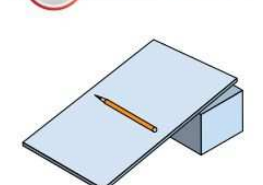

# §50. Механическая работа. Единицы работы

> Источник: Физика. 7 класс. Базовый уровень (Перышкин, Иванов, 2026), стр. 174–177
> Ключевые слова: механическая работа, работа силы, формула A=Fs, джоуль, Джеймс Джоул, положительная работа, отрицательная работа, сила трения совершает отрицательную работу, работа равна нулю, перпендикулярно скорости, мДж кДж МДж, пример кран 3 т 7 м 210 кДж, теннис 200 км/ч, шкаф, эквивалентность работы, упражнение 32, задание 36

*(Открывает главу 4 «Работа и мощность. Энергия» — на развороте рисунок рукописи Леонардо да Винчи с машинами.)*

Понаблюдаем за игрой теннисистов. Что они делают во время подачи, чтобы мяч с огромной скоростью (до 200 км/ч) отправился на сторону противника? Теннисист замахивается ракеткой, и движущаяся ракетка действует на мяч. Чем больше сила, с которой ракетка действует на мяч, и больше расстояние, которое пройдёт ракетка вместе с мячом, тем больше будет скорость мяча. Когда тело движется под действием силы, совершается **механическая работа**.

Предположим, что тело, двигаясь *прямолинейно в одном направлении*, прошло путь *s* и при этом на него *в направлении движения* действовала *постоянная сила* F. В этом случае механическая работа, или **работа силы**, определяется как *произведение модуля силы на пройденный путь*.

Работу обозначают буквой *A* и рассчитывают по формуле

A = Fs.

*Сила F совершает работу A = Fs (другие действующие на тело силы на рисунке не показаны) — рисунок: брусок перемещается под действием силы F на путь s.*

Человек поднимает с земли камень на какую-то высоту. При этом сила, которую он прикладывает к камню, совершает работу¹. Чем тяжелее камень, тем бо́льшую силу надо прикладывать и тем больше будет совершённая работа. Можно один и тот же камень поднимать на разную высоту. Сила требуется для этого одна и та же, но работа будет совершаться разная. **Чем больше высота подъёма, тем больше работа.**

¹ В дальнейшем мы иногда будем использовать выражения типа «рука человека совершила работу». В таких случаях имеется в виду работа силы, действующей со стороны данного тела (например, руки) на какое-то другое тело.

Понятие «работа» в физике отличается от его обыденного употребления. Человек пытается сдвинуть шкаф. Обыватель скажет, что человек устал, совершая работу. А физик отметит, что действующая на шкаф сила не совершает работы, так как шкаф не перемещается.

Итак, когда под действием силы тело не перемещается, работа равна нулю. Если тело перемещается, но на него не действует сила или сила действует перпендикулярно скорости тела, то работа тоже равна нулю. Так, равна нулю работа силы тяжести, действующей на тело, движущееся по горизонтальной поверхности.

*Фото: Совершение работы электровозом по перемещению вагонов поезда.*

Если направление силы совпадает с направлением движения тела, то данная сила совершает **положительную работу**. В этом случае сила способствует движению тела. Но бывает и так, что сила препятствует движению. В этом случае движение тела происходит в направлении, противоположном направлению приложенной силы, например силы трения скольжения, и данная сила совершает **отрицательную работу**:

A = -F_трs.

В случае действия на тело нескольких сил можно говорить о работе каждой из них в отдельности и о работе равнодействующей этих сил. Допустим, мы тянем брусок с помощью динамометра и перемещаем его по горизонтальной поверхности стола на некоторое расстояние (см. рис. 88, *а*). Тогда работа силы упругости пружины положительная, работа силы трения отрицательная, а работа силы тяжести и работа силы упругости, действующей на брусок со стороны стола, равны нулю. Если движение бруска прямолинейное равномерное, то равнодействующая всех сил равна нулю, поэтому равна нулю и работа равнодействующей.

Единица работы в СИ — **джоуль (Дж)** — названа в честь английского учёного **Джеймса Джоуля (1818—1889)**.

**1 Дж — это работа, которая совершается силой 1 Н на пути 1 м при движении тела в направлении этой силы.**

1 Дж = 1 Н · 1 м = 1 Н · м.

*1 Дж = 10³ мДж; 1 Дж = 10⁻³ кДж; 1 Дж = 10⁻⁶ МДж.*

1 Дж — небольшая работа. Например, при подъёме ведра воды с пола на стул совершается работа приблизительно 60 Дж. При разгоне легкового автомобиля до скорости 72 км/ч совершается работа около 200 000 Дж. Для запуска искусственного спутника Земли необходимо совершить работу в миллиарды джоулей.

Широко применяются дольные и кратные единицы работы: **миллиджоуль (мДж)**, **килоджоуль (кДж)**, **мегаджоуль (МДж)**.

1 мДж = 0,001 Дж = 10⁻³ Дж; 1 кДж = 1000 Дж = 10³ Дж; 1 МДж = 1 000 000 Дж = 10⁶ Дж.

*Фото: Совершение работы при подъёме судна (кран поднимает секцию судна).*

## Пример

Определите работу, совершённую краном при равномерном подъёме тела массой 3 т на высоту 7 м.

Запишем условие задачи и решим её.

**Дано:** *m* = 3 т; *h* = *s* = 7 м; *g* = 10 м/с²; *A* — ?  **СИ:** 3000 кг

**Решение:** На тело действует сила тяжести и сила натяжения (упругости) троса. Нам нужно определить работу крана, следовательно, вычислить работу силы упругости. Сила упругости по направлению совпадает с перемещением тела, а по модулю равна силе тяжести, так как движение равномерное:

F_упр = F_тяж = mg, F_упр = 3000 кг · 10 м/с² = 30 000 Н.

Работа по поднятию тела: *A* = *F*_упр*s*; *A* = 30 000 Н · 7 м = 210 000 Дж = 210 кДж.

**Ответ:** *A* = 210 кДж.

**Вопросы** (стр. 177)

1. При каких условиях совершается механическая работа? 2. По какой формуле можно определить совершённую работу? 3. В каком случае механическая работа равна нулю; отрицательна? 4. Что принимают за единицу работы в СИ?

**Дополнительное задание** (стр. 177)

Совершает ли работу сила тяжести в следующих случаях: а) камень падает на землю; б) человек идёт по горизонтальной поверхности; в) человек на плечах держит тяжёлый груз; г) человек поднимается в лифте? Совершается ли работа в каждом из этих случаев какой-либо другой силой?

**Упражнение 32** (стр. 177)

1. Тело под действием горизонтальной силы 5 Н перемещается по горизонтальному полу на 20 м. Какая работа совершается этой силой?
2. Камень массой 200 г поднят на высоту 6 м. Какую работу совершила сила тяжести? Чему будет равна работа силы тяжести при падении камня?
3. При равномерном подъёме из колодца ведра воды массой 10 кг была совершена работа 650 Дж. Какова глубина колодца?
4. Шагающий экскаватор поднимает за один приём 14 м³ грунта на высоту 20 м. Вес ковша без грунта 20 кН. Определите работу, совершаемую по подъёму грунта и ковша. Плотность грунта 1500 кг/м³.

**Задание 36** (стр. 177)

Сделайте наклонную плоскость из картона (рис. 165). Положите на неё карандаш. Проследите за тем, как он скатывается. Совершается ли при этом работа? За счёт работы какой силы увеличивается скорость карандаша? Увеличьте угол наклона. Как изменяется скорость карандаша при прохождении того же пути? Проследите за тем, чтобы путь всё время был одинаковым при изменении угла наклона. Сделайте вывод о зависимости работы от угла между силой и скоростью тела.

