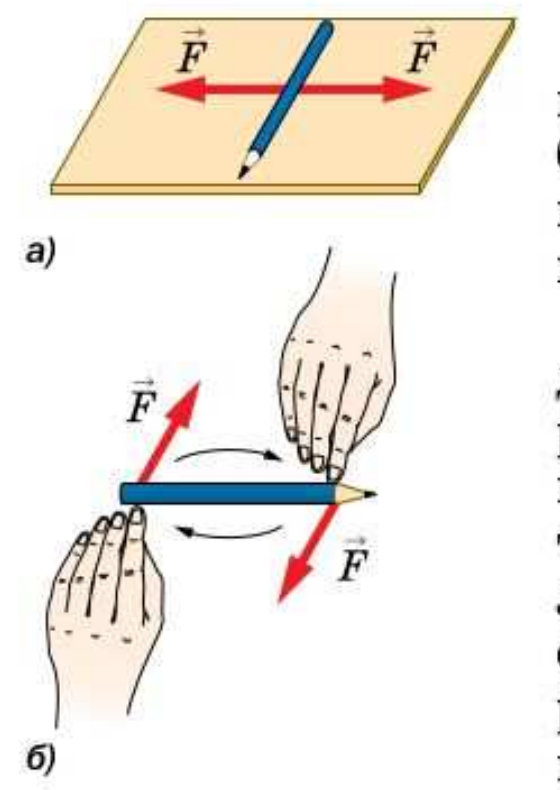
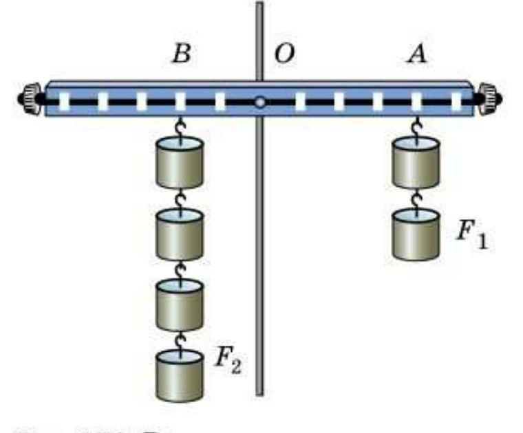
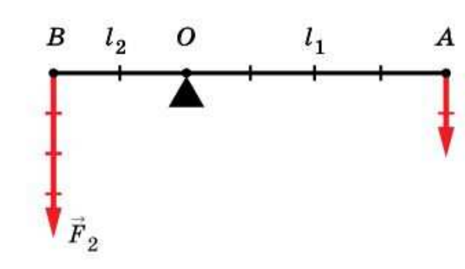
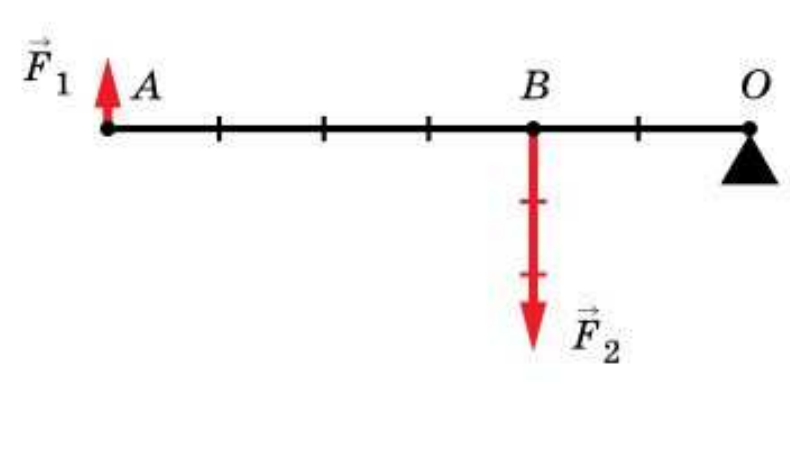

# §53. Рычаг. Равновесие сил на рычаге

> Источник: Физика. 7 класс. Базовый уровень (Перышкин, Иванов, 2026), стр. 183–187
> Ключевые слова: рычаг, плечо силы, линия действия силы, рычаг первого рода, рычаг второго рода, равновесие рычага, правило Архимеда F1/F2=l2/l1, опыт с бруском карандашом, руль велосипеда, подкидная доска, домкрат 600 кг 300 Н, плечо в 20 раз, упражнение 34

Вам уже известно, что если на тело действуют две равные по модулю, но противоположно направленные силы, то они уравновешивают друг друга. Всегда ли это верно? Это верно для случая, когда силы направлены по одной прямой.

Положите карандаш на стол, подействуйте на него с равным усилием пальцами рук в любой точке в противоположных направлениях, но по одной прямой, как показано на рисунке 169, *а*. Силы уравновешивают друг друга.

Изменим условия опыта. Одновременно подействуйте параллельно на разные концы карандаша. Силы по-прежнему равны и противоположно направлены, но приложены к разным точкам и действуют не вдоль одной прямой. Линии действия этих сил параллельны, но не совпадают (рис. 169, *б*). Карандаш начал поворачиваться, значит, действие таких сил не компенсируется.

Подобные явления мы часто наблюдаем в жизни: поворот руля велосипеда, наклон дерева под действием ветра, движение подкидной доски в номере циркового акробата.

Рассмотрим ситуацию, когда тело может вращаться относительно некоторой оси, неподвижной относительно поверхности Земли. Исследуем условия, при которых такое тело находится в равновесии (все его части неподвижны относительно поверхности Земли). Для удобства исследования возьмём деревянную планку с отверстием в центре. Закрепим её в штативе на оси, находящейся посередине планки (рис. 170). По разные стороны от оси прикрепим грузы. С их помощью будем действовать одновременно на обе стороны планки.

Подвесим справа от оси два груза (масса каждого груза 100 г), а слева четыре таких же груза. Планка не поворачивается, если расстояние от оси до точки подвеса правых грузов *OA* в 2 раза больше, чем аналогичное расстояние *OB* слева. Значит, действие силы справа уравновешивается действием силы слева.

Заметим, что на левую часть планки действует сила 4 Н, т. е. в 2 раза большая, чем на правую часть планки — 2 Н.

В этом опыте, схема которого приведена на рисунке 171, мы познакомились с рычагом.

> **Рычагом называют любое твёрдое тело, которое может вращаться вокруг неподвижной оси или точки опоры.**

Мы рассмотрели рычаг, у которого точки приложения сил (*A* и *B*) находятся по разные стороны от оси вращения (*O*). Такой рычаг называют рычагом **первого рода**. При равновесии рычага первого рода обе действующие на рычаг силы направлены в одну сторону, но стремятся повернуть его в противоположные стороны — сила F_1 по ходу часовой стрелки, сила F_2 против хода часовой стрелки (см. рис. 171).

Существуют и такие рычаги, у которых точки приложения сил находятся по одну сторону от оси вращения. Эти рычаги называют рычагами **второго рода** (см. рис. 167, *б*). При равновесии рычага второго рода (рис. 172) приложенные к нему силы направлены в противоположные стороны.

*Фото: Рычаг демонстрационный (классная доска с делениями и грузами на штативе).*

Сформулируем условие равновесия рычага, используя результаты опыта, изображённого на рисунке 170. Для этого введём понятие **плеча силы**.

> **Длину перпендикуляра, проведённого от оси вращения рычага до линии действия силы¹, называют плечом силы.**

¹ Линия действия силы — это прямая, на которой лежит вектор силы.

На рисунках 171 и 172 плечами сил *F*₁ и *F*₂ являются соответственно расстояния *l*₁ = *OA* и *l*₂ = *OB*. Сравним силы *F*₁ и *F*₂ (см. рис. 171), действующие на рычаг, и их плечи *l*₁ и *l*₂, получим следующее **условие (правило) равновесия рычага**.

> **Рычаг находится в равновесии тогда, когда силы, действующие на него, обратно пропорциональны плечам этих сил.**

Это правило описывается формулой

F_1/F_2 = l_2/l_1

и справедливо для рычагов как первого (см. рис. 171), так и второго рода (см. рис. 172).

*Фото: Рычаг лабораторный (учебный рычаг на подставке с крючками и грузами).*

Правило равновесия рычага было установлено Архимедом. Согласно этому правилу, используя рычаг, можно меньшей силой уравновесить бо́льшую силу. Например, если одно плечо рычага в 2 раза больше другого (см. рис. 171), то приложенную в точке *B* силу 1000 Н можно уравновесить, приложив в точке *A* силу 500 Н.

Может ли мальчик удержать автомобиль массой 600 кг с помощью рычага? Вес автомобиля равен примерно 6000 Н. Пусть сила, которую прикладывает мальчик, равна 300 Н. Значит, плечо этой силы должно быть в 20 раз длиннее плеча веса автомобиля. В этом случае рычаг будет в равновесии.

*Фото: Использование рычажного домкрата (рычаг-домкрат поднимает бампер автомобиля).*

Что произойдёт, если мальчик будет действовать с большей силой? Рычаг начнёт поворачиваться. Другими словами, с помощью рычага мальчик может приподнять автомобиль. Рычаг — один из первых простых механизмов, который начал использовать человек. Ведь рычагом может служить любая палка.

**Вопросы** (стр. 187)

1. Что называют рычагом? Приведите примеры рычагов. 2. Дайте определение плеча силы. 3. Составьте правило нахождения плеча силы. 4. Сформулируйте правило равновесия рычага.

**Дополнительное задание** (стр. 187)

1. Когда палку держат в руках за концы, то её трудно переломить. Если же середину палки положить на подставку, то переломить палку будет легче. Почему? 2. Докажите, что равноплечий рычаг не даёт выигрыша в силе.

**Упражнение 34** (стр. 187)

1. К концам рычага, находящегося в равновесии, приложены вертикальные силы 25 и 15 Н. Длинное плечо рычага равно 15 см. Какова длина короткого плеча?
2. На концы рычага действуют вертикальные силы 8 и 40 Н. Длина рычага 90 см. Где расположена точка опоры, если рычаг находится в равновесии? Выполните рисунок.
3. На рычаге уравновешены две гирьки разной массы, но изготовленные из одного материала. Изменится ли равновесие рычага, если обе гирьки поместить в воду?
