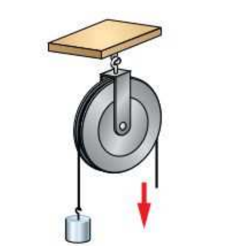
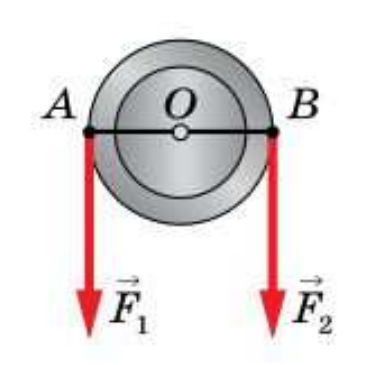
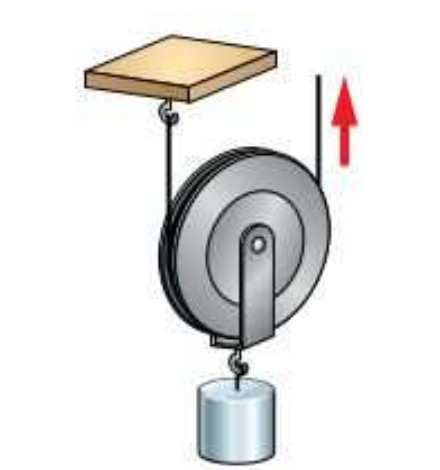
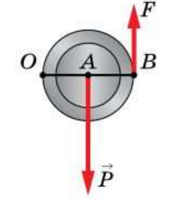
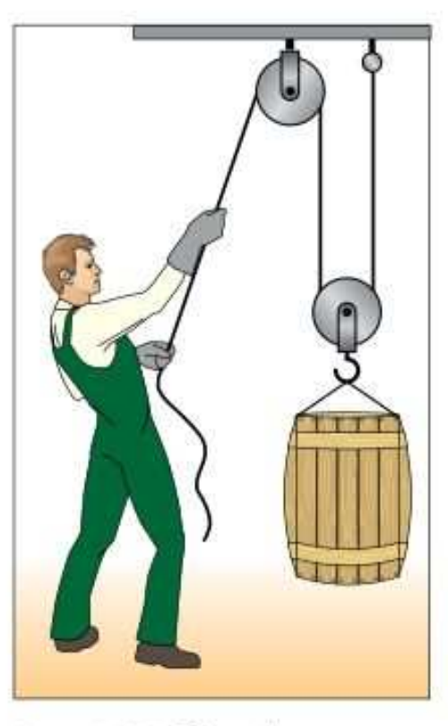

# §56. Применение правила равновесия рычага к блоку

> Источник: Физика. 7 класс. Базовый уровень (Перышкин, Иванов, 2026), стр. 190–192
> Ключевые слова: блок, неподвижный блок, подвижный блок, колесо с жёлобом, равноплечий рычаг, подвижный блок рычаг с неравными плечами, F=P/2 выигрыш в 2 раза, полиспаст, альпинисты переправы, вопросы 1-4

Одна из разновидностей рычага — **блок**. Основной частью блока является колесо с жёлобом, через который пропускают верёвку или трос. Блоки бывают подвижные и неподвижные.

Блок является **неподвижным**, если его ось неподвижно закреплена (рис. 181).

Покажем, что неподвижный блок можно рассматривать как равноплечий рычаг. Для того чтобы удержать груз, действующий на левый конец верёвки с силой F_1, нужно приложить силу F_2 к правому концу верёвки (рис. 182). Плечи этих сил — расстояния *OA* и *OB* от оси блока *O* до точек приложения сил *A* и *B*. Поскольку *OA* = *OB* (плечи обеих сил равны радиусу блока), то неподвижный блок является равноплечим рычагом.

Вы знаете, что если плечи рычага равны, то он не даёт выигрыша в силе. Следовательно, **неподвижный блок не даёт выигрыша в силе, а только изменяет направление её действия**.

Помимо неподвижного блока, широкое применение получил **подвижный блок**. Его ось может подниматься и опускаться вместе с грузом, так как она не закреплена (рис. 183).

На рисунке 184 изображена схема подвижного блока, где стрелками показаны действующие силы. Подвижный блок подобен рычагу с точкой опоры *O*, расположенной на его конце. Вес груза P приложен к точке *A*, мы тянем за верёвку с силой F, приложенной к точке *B*. Плечо силы *P* — отрезок *OA*, длина его равна радиусу блока. Плечо силы *F* — отрезок *OB*, равный диаметру блока. Плечо *OB* в 2 раза больше плеча *OA*, значит, сила *F* в 2 раза меньше силы *P*:

F = P/2.

Таким образом, **применение подвижного блока позволяет получить выигрыш в силе в 2 раза**.

На практике часто используют комбинацию подвижного блока с неподвижным (рис. 185). Выигрыш в силе даёт подвижный блок, а неподвижный блок используется для удобства. Он позволяет выбрать удобное направление воздействия на трос, например, чтобы поднимать груз, стоя на земле. Такие комбинации блоков (**полиспасты**) применяют, в частности, альпинисты для подъёма в горах, переправы через реки.

**Вопросы** (стр. 192)

1. Что такое блок? 2. Какие типы блоков вам известны? Охарактеризуйте каждый из них. 3. Докажите, что неподвижный и подвижный блоки можно рассматривать как рычаги. 4. Приведите примеры применения блоков разных типов.
