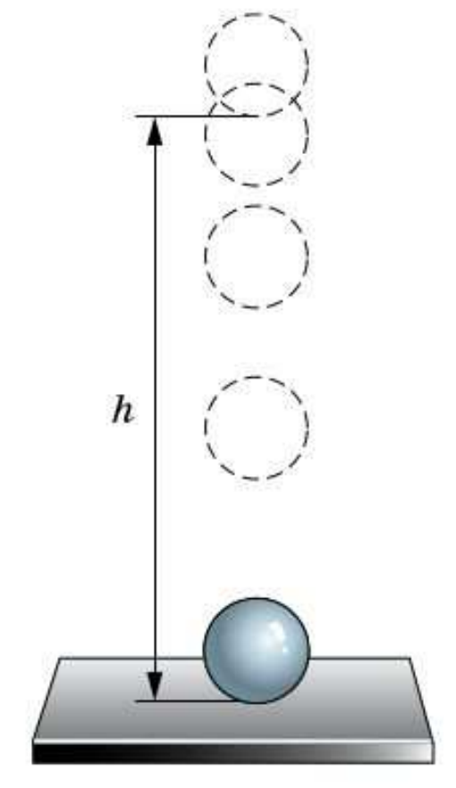
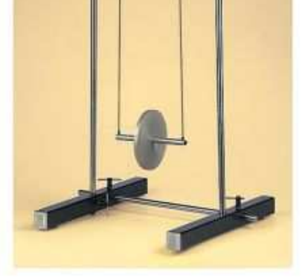

# §60. Превращение механической энергии одного вида в другой

> Источник: Физика. 7 класс. Базовый уровень (Перышкин, Иванов, 2026), стр. 202–205
> Ключевые слова: превращение энергии, закон сохранения механической энергии, маятник Максвелла, падение шара, удар упругий, передача энергии при столкновении, силы трения, затухание, упражнение 39, задание 41, рис. 191, рис. 192

Очень часто тела обладают и кинетической, и потенциальной энергией одновременно. Что происходит с кинетической и потенциальной энергией при движении тела? Может ли измениться механическая энергия тела?

Рассмотрим опыт, изображённый на рисунке 191. На земле лежит стальная плита. На высоте h над плитой удерживают стальной шарик. При этом он обладает потенциальной энергией

E_п = mgh.

Если выпустить шарик из рук, благодаря притяжению к Земле он будет двигаться вниз. Его высота над плитой начнёт уменьшаться. Поэтому и потенциальная энергия тоже уменьшится. Значит ли это, что энергия исчезает? Нет, так как скорость шарика в процессе падения увеличивается. Следовательно, его кинетическая энергия E_к будет увеличиваться. Так потенциальная энергия переходит в кинетическую.

Максимального значения кинетическая энергия достигнет в момент падения шарика на плиту. В это же мгновение высота шарика h над плитой, а значит, и его потенциальная энергия станут равными нулю. Вся потенциальная энергия перешла в кинетическую.

При ударе шарика о плиту происходит деформация как шарика, так и плиты. Кинетическая энергия шарика переходит в потенциальную энергию деформированных шарика и плиты. В результате действия упругих сил шарик и плита примут свою первоначальную форму, шарик отскочит от плиты. Потенциальная энергия вновь перейдёт в кинетическую.

**Рис. 191.** При падении потенциальная энергия шарика превращается в кинетическую: а) на высоте h тело обладает потенциальной энергией E_п = mgh, кинетическая энергия равна нулю; б) у плиты потенциальная энергия равна нулю, кинетическая энергия максимальна

Шарик, отскочив от плиты, станет подниматься вверх и замедляться. Его кинетическая энергия будет уменьшаться, а потенциальная — увеличиваться. Кинетическая энергия снова перейдёт в потенциальную.

Итак, рассмотренный опыт с шариком и плитой показывает, как происходит превращение энергии одного вида в энергию другого вида. Такими превращениями сопровождаются различные процессы в природе, технике и быту. Например, при падении воды с плотины её потенциальная энергия превращается в кинетическую. Периодически кинетическая и потенциальная энергии переходят друг в друга и в маятнике Максвелла (рис. 192).

**Рис. 192.** Маятник Максвелла

Вернёмся к примеру с шариком. Когда он отскочил от плиты и поднимается вверх, кинетическая энергия переходит в потенциальную. Эксперименты показывают, что *при отсутствии сопротивления воздуха кинетическая энергия уменьшается на столько, на сколько увеличивается потенциальная энергия*. Это означает, что механическая энергия, равная сумме кинетической и потенциальной энергии, остаётся постоянной (сохраняется).

Как показали теоретические и экспериментальные исследования, механическая энергия системы тел сохраняется, если между телами действуют только силы тяготения и силы упругости. При этом важно, чтобы действием на рассматриваемую систему посторонних тел можно было бы пренебречь.

Таким образом, можно сформулировать **закон сохранения механической энергии**:

> **механическая энергия системы тел, взаимодействующих только друг с другом и только силами тяготения и силами упругости, остаётся постоянной.**

E_к1 + E_п1 = E_к2 + E_п2,

где E_к1, E_п1 — кинетическая и потенциальная энергия системы в момент времени 1; E_к2, E_п2 — кинетическая и потенциальная энергия системы в момент времени 2.

Энергия может не только переходить из одного вида в другой, но и перераспределяться между телами системы. Например, в результате столкновения стального шара с другим таким же шаром, но неподвижным, первый шар останавливается, а второй начинает двигаться со скоростью, которой обладал первый шар до столкновения. В этом примере механическая энергия системы из двух шаров не изменяется, но происходит передача энергии от одного шара другому.

В реальных процессах механическая энергия обычно не остаётся постоянной, а уменьшается со временем. Дело в том, что в любой системе в той или иной форме действуют силы трения. В результате брусок, скользящий по столу, останавливается, колебания маятника затухают, мяч подскакивает на всё меньшую и меньшую высоту и в итоге остаётся лежать на полу.

Обратим внимание, что убывание механической энергии не означает, что энергия исчезает бесследно. В действительности она переходит из механической в другую форму. С этим другим видом энергии вы познакомитесь в следующем учебном году.

**Вопросы** (стр. 204)

1. Как меняется потенциальная и кинетическая энергия при падении тела?
2. Какие превращения энергии происходят при ударе стального шарика о стальную плиту?
3. Приведите примеры физических явлений, в которых кинетическая и потенциальная энергия переходят друг в друга.
4. Предложите эксперимент, подтверждающий, что энергия может переходить от одного тела к другому.
5. Сформулируйте закон сохранения механической энергии.

**Дополнительное задание** (стр. 205)

Что, по вашему мнению, вносит наибольший вклад в энергию вылетающей из лука стрелы — корпус лука или тетива?

**Упражнение 39** (стр. 205)

1. Стальной шарик висит на нити. Отклоним его в сторону и отпустим. Какие превращения энергии при этом происходят?
2. Мяч массой 100 г подброшен с поверхности земли вертикально вверх со скоростью 20 м/с. Чему равна его потенциальная энергия в высшей точке подъёма?

**Задание 41** (стр. 205)

1. Проверьте на опыте закон сохранения механической энергии. Для этого сделайте наклонную плоскость, например, из кабель-канала. Высоту подберите таким образом, чтобы брусок начинал движение из верхней точки без вашей помощи. Движение бруска по наклонной плоскости прямолинейное равноускоренное с начальной скоростью, равной нулю. В этом случае скорость бруска у основания наклонной плоскости можно определить по формуле

   v = 2l/t,

   где l — длина наклонной плоскости, t — время движения. Учитывая, что потенциальная энергия тела E_п = mgh, а кинетическая — E_к = mv²/2, можно сравнивать значения gh и v²/2. Обсудите результаты опыта с одноклассниками и учителем. Какой вывод можно сделать на основе полученных результатов?
2. Посмотрите ролик «Маятник Максвелла» https://gotourl.ru/12654. Изучите принципы работы маятника. Почему маятник с течением времени поднимается на меньшую высоту? На что расходуется первоначальная энергия маятника?
