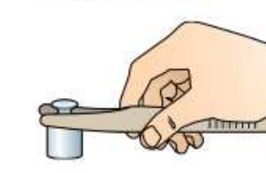

# Лабораторная работа №3. Измерение массы тела

> Источник: Физика. 7 класс. Базовый уровень (Перышкин, Иванов, 2026), стр. 210–211, раздел «Лабораторные работы»
> Ключевые слова: лабораторная работа 3, измерение массы, рычажные весы, электронные весы, разновесы, гири, пинцет, таблица 11, таблица 12, среднее значение массы, многократные измерения, абсолютная погрешность

**Цель работы.** Измерить массу тела с помощью весов.

**Приборы и материалы.** Весы рычажные с разновесами, электронные весы, несколько небольших тел разной массы.

## Указания к работе

1. Измерьте массу предложенных тел с помощью рычажных весов (см. п. 1 примечания). На левую чашу весов осторожно положите взвешиваемое тело. На правую чашу поставьте гири, начиная с большей. Методом подбора добейтесь равновесия весов (см. п. 2 примечания). Подсчитайте общую массу гирь, лежащих на правой чаше весов. Затем гири перенесите обратно в футляр.

**Примечание.** 1. Перед взвешиванием проверьте, что весы уравновешены. При необходимости для установления равновесия на более лёгкую чашу весов следует положить полоску бумаги. 2. Гири следует брать пинцетом (рис. 194).

**Рис. 194.** Гири следует брать пинцетом

2. **Обработка результатов измерений.** Результаты прямых измерений с учётом абсолютной погрешности запишите в таблицу 11. Абсолютную погрешность измерения массы считайте равной массе наименьшего разновеса, выводящего весы из равновесия.

**Таблица 11**

| № опыта | Название тела | Масса гирь, которыми уравновешено тело | Масса тела m ± Δm, г |
|---|---|---|---|

3. Проведите измерения массы этих же тел с помощью электронных весов.

**Примечание.** Измерение массы каждого тела проведите не менее трёх раз.

4. **Обработка результатов измерений.** Вычислите среднее значение массы m_ср по результатам многократных измерений по формуле:

m_ср = (m_1 + m_2 + m_3)/3.

Результаты прямых измерений с учётом абсолютной погрешности (указана в паспорте электронных весов) и вычислений запишите в таблицу 12. О том, как определить погрешность Δm_ср, узнайте у учителя.

**Таблица 12**

| Название тела | m_1 ± Δm, г | m_2 ± Δm, г | m_3 ± Δm, г | m_ср ± Δm_ср, г |
|---|---|---|---|---|

5*. Покажите на числовой оси для каждого опыта интервал возможных значений массы.

6. Сравните результаты измерений на рычажных и электронных весах. Сделайте вывод, в каком случае провести измерения получилось с большей точностью (меньшей абсолютной погрешностью).
