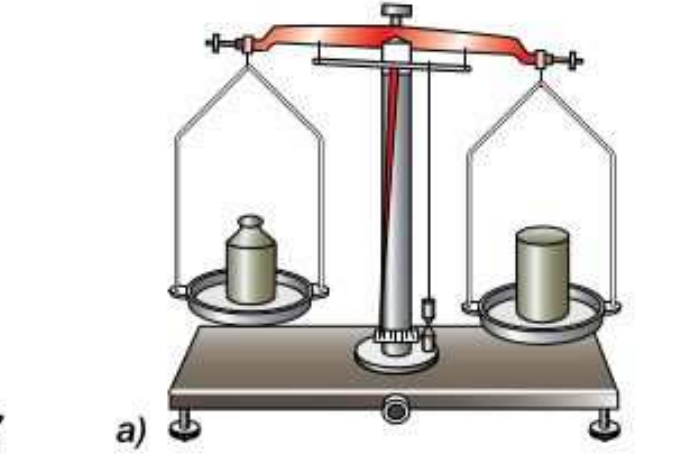

# Лабораторная работа №5. Определение плотности твёрдого тела

> Источник: Физика. 7 класс. Базовый уровень (Перышкин, Иванов, 2026), стр. 213–214, раздел «Лабораторные работы»
> Ключевые слова: лабораторная работа 5, плотность твёрдого тела, рычажные весы, измерительный цилиндр, таблица 14, формула плотности ρ = m/V, определение вещества по таблице плотности, рис. 197

**Цель работы.** Определить плотность вещества твёрдого тела с помощью весов и измерительного цилиндра.

**Приборы и материалы.** Весы рычажные с разновесами, измерительный цилиндр, твёрдое тело неизвестной плотности, нить.

## Указания к работе

1. Измерьте массу тела на весах (рис. 197, *а*).

**Рис. 197.** *а*) измерение массы тела на весах; *б*) измерение объёма тела с помощью измерительного цилиндра

2. **Обработка результатов измерений.** Результаты прямых измерений с учётом абсолютной погрешности и вычислений записывайте в таблицу 14.

**Таблица 14**

| Масса тела m ± Δm, г | Объём тела V ± ΔV, см³ | Плотность вещества ρ, г/см³ | Плотность вещества ρ, кг/м³ |
|---|---|---|---|

3. Измерьте объём тела с помощью измерительного цилиндра (рис. 197, *б*).

4. Проанализируйте таблицу 3 (§23 «Плотность вещества»), чтобы понять, в каких границах значений можно получить плотность твёрдого тела.

5. Рассчитайте по формуле ρ = m/V плотность вещества, из которого сделано тело.

6. Сделайте вывод, попадает ли полученный результат в определённые вами границы значений.

7. По таблице 3 определите вещество, из которого может быть сделано данное тело.
