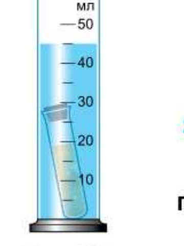

# Лабораторная работа №10. Выяснение условий плавания тела в жидкости

> Источник: Физика. 7 класс. Базовый уровень (Перышкин, Иванов, 2026), стр. 219–220, раздел «Лабораторные работы»
> Ключевые слова: лабораторная работа 10, условия плавания тел, пробирка с песком, аптечный пузырёк, частичное погружение, всплывание, потопление, таблица 18, сила тяжести Fтяж = mg, выталкивающая сила FА = ρжVg, объём вытесненной воды, рис. 199

**Цель работы.** Исследовать явление плавания тел в жидкости.

**Приборы и материалы.** Весы рычажные с разновесами, измерительный цилиндр, пробирка (аптечный пузырёк) с пробкой, проволочный крючок, сухой песок, фильтровальная бумага или сухая тряпка.

## Указания к работе

1. Регулируя с помощью песка степень погружения пробирки в воду (рис. 199), добейтесь частичного погружения пробирки, полного погружения, опускания пробирки на дно сосуда.

**Рис. 199.** Регулирование степени погружения пробирки с песком в воде

2. Для каждого случая определите массу пробирки с песком и силу тяжести F_тяж = mg.

**Примечание.** Перед тем как положить на весы пробирку с песком, протрите её фильтровальной бумагой или тряпкой.

3. **Обработка результатов измерений.** Результаты прямых измерений с учётом абсолютной погрешности, равной цене деления шкалы прибора, и вычислений записывайте в таблицу 18. Отметьте, когда пробирка плавает и когда тонет или всплывает.

**Таблица 18**

| № опыта | Масса пробирки с песком m ± Δm, кг | Сила тяжести пробирки с песком F_тяж, Н | Объём вытесненной воды V ± ΔV, м³ | Выталкивающая сила, действующая на пробирку F_А, Н | Поведение пробирки в воде |
|---|---|---|---|---|---|

4. Для каждого случая определите объём вытесненной воды и рассчитайте выталкивающую силу F_А = ρ_ж V g.

5. Сделайте вывод об условии плавания тела в жидкости.
