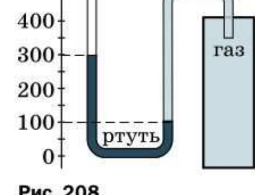
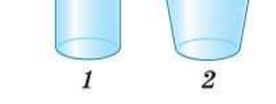

# Задачи для повторения. Давление твёрдых тел, жидкостей и газов (задачи 83–100)

> Источник: Физика. 7 класс. Базовый уровень (Перышкин, Иванов, 2026), стр. 229–231, раздел «Задачи для повторения»
> Ключевые слова: задачи для повторения, давление, задача 83 — задача 100, давление твёрдых тел, давление жидкостей и газов, атмосферное давление, манометр, гидравлический пресс, закон Паскаля, выталкивающая сила, плавание тел, трактор на льду, бетонные кубики, рис. 208, рис. 209

**83.** Масса двухосного прицепа с грузом равна 2,5 т. Определите давление, оказываемое прицепом на дорогу, если площадь соприкосновения каждого колеса с дорогой равна 125 см².

**84.** Токарный станок массой 300 кг опирается на фундамент четырьмя ножками. Определите давление станка на фундамент, если площадь каждой ножки 50 см².

**85.** Для испытания бетона на прочность из него изготовляют кубики размером 10 × 10 × 10 см. При сжатии под прессом кубики начали разрушаться при действии на них силы 480 кН. Определите минимальное давление, при котором этот бетон начинает разрушаться.

**86.** Лёд выдерживает давление 90 кПа. Пройдёт ли по этому льду трактор, если его вес 30 кН и он опирается на гусеницы общей площадью 1,5 м²?

**87.** Из бутылки трудно пить, когда её горлышко плотно охвачено губами. Почему?

**88.** Почему при накачивании воздуха в шину велосипеда с каждым разом всё труднее двигать ручку насоса?

**89.** Под колоколом воздушного насоса находится сосуд, закупоренный пробкой. Почему при выкачивании воздуха из-под колокола пробка может вылететь?

**90.** Одно из колен манометра соединили с сосудом, заполненным газом (рис. 208). Чему равно давление газа в сосуде, если атмосферное давление составляет 766 мм рт. ст.?

**Рис. 208.** Манометр: уровень ртути в открытом колене — 300 мм, в соединённом с газом — 100 мм

**91.** Чтобы увеличить напор, под которым нефть поступает из скважины на поверхность земли, в глубину по трубам насоса подаётся вода, которая давит на нефть и заставляет её непрерывно подниматься. Какой физический закон используется при этом?

**92.** Сосуды 1 и 2 заполнены водой (рис. 209). Высота столба жидкости 10 см, площадь дна сосудов 1 см². Определите давление и силу давления на дно каждого сосуда.

**Рис. 209.** Сосуды 1 и 2, заполненные водой до одинаковой высоты

**93.** На сколько давление воды на глубине 10 м больше, чем на глубине 1 м?

**94.** При выстреле из мелкокалиберной винтовки в варёное яйцо в нём образуется отверстие. Если выстрелить в сырое яйцо, то оно разлетится. Объясните это явление.

**95.** Площадь малого поршня гидравлического пресса 10 см², на него действует сила 100 Н. Площадь большого поршня 200 см². Какая сила действует на большой поршень?

**96.** Малый поршень гидравлического пресса площадью 2 см² под действием силы опустился на 16 см. Площадь большого поршня 8 см². Определите: *а*) вес груза, поднятого поршнем, если на малый поршень действовала сила 200 Н; *б*) на какую высоту поднялся груз.

**97.** Жидкость давит на тело, погружённое в неё, сверху, снизу и с боков. Почему же выталкивающая сила всегда направлена вертикально вверх?

**98.** Когда молоко подливают в кофе, то оно опускается на дно чашки. Почему?

**99.** Пробирку полностью поместили в измерительный цилиндр с водой. Уровень воды в нём при этом повысился от деления 100 до 200 мл. Сколько весит пробирка, плавающая в воде?

**100.** Шарик массой 250 г плавает на поверхности воды. Определите объём части шарика, находящейся под водой.
